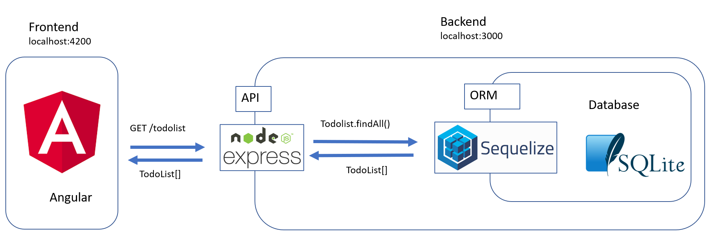

# ese2020-project-scaffolding

## About
This project contains an Angular frontend and an NodeJs backend which uses Express as a framework. The website displays todolists which can be customized with items to complete. Every list and item is saved in a database, meaning they will still be available after you restart the website or the backend. 

## Prerequisite
First of all you have to install [NodeJs](https://nodejs.org/de/download/), which comes per default with the packet manager [npm](https://www.npmjs.com/get-npm).
To verify the installation worked, type `npm -v` and `node -v` in your favourite command line interface (cli). If a version number appears and no error message appears the installation was successful.

## Start
If you would like to use this scaffolding as a basis for your actual project (which we recommend): 
- please download or clone your teams repository (for example, by running `git clone https://github.com/scg-unibe-ch/ese2020-team1>` at your desired location ), 
- download as a zip file or clone this repository inside your team's repository,
- unzip if downloaded as a zip,
- and ***delete the .git folder*** from this repository (WARNING: keep .git folder from your team's repo). 
Then you can follow the README in the frontend folder and backend folder respectively. 

## General Information
Note that the folders deliverables, frontend and backend are present on the top level of the repository. Your repository should also contain these three folders. 
You should take the rest of the structure as a guide but you may also use your own folder structure.

## Technologies 
The image below gives you an overview on the different technologies used. You can find informations about them by consulting the [reading list](https://github.com/scg-unibe-ch/ese2020/wiki/Reading-list). It shows a request the frontend makes to the backend.

# ese2020-team11
